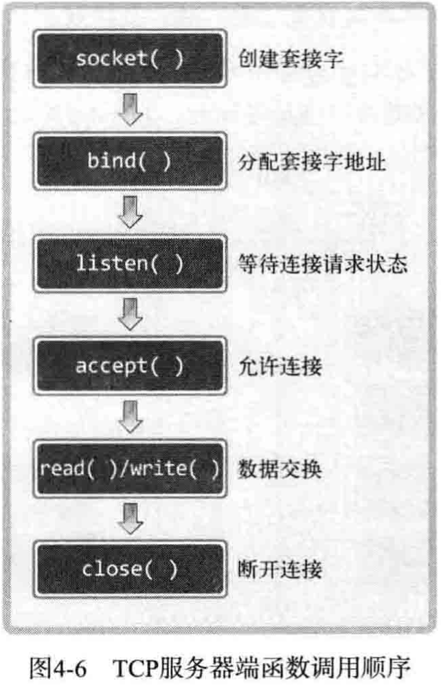

[TOC]


## 第一章 理解网络编程和套接字


### 1.1 理解网络编程和套接字

---

#### 构建电话套接字

1. 调用 socket 函数，用于创建套接字，可以理解为安装电话机。

```C++
#include <sys/socket.h>
int socket(int domain, int type, int protocol);

// 成功时返回文件描述符，失败时返回-1
```

2. 调用 bind 函数，给创建好的套接字分配地址信息（IP 地址和端口号），相当于分配电话号码。

```C++
#include <sys/socket.h>
int bind(int sockfd, struct sockaddr *myaddr, socklen_t addrlen);

// 成功时返回0，失败时返回-1
```

3. 调用 listen 函数，将套接字转化成可接收请求的状态，相当于连接电话线。

```C++
#include <sys/socket.h>
int listen(int sockfd, int backlog);

// 成功时返回0，失败时返回-1
```

4. 调用 accept 函数， 受理连接请求，相当于拿起话筒。

```C++
#include <sys/socket.h>
int accept(int sockfd, struct sockaddr *addr, socklen_t *addrlen);
```


#### 构建打电话套接字

调用 connect 函数向服务器端发送连接请求。

```C++
#include <sys/socket.h>
int connect(int sockfd, struct sockaddr *serv_addr, socklen_t addrlen);

// 成功时返回0，失败时返回-1
```


#### 代码 & 编译运行

服务器端：[hello_server.cpp](Part01_Start-socket-programming/code/hello_world/hello_server.cpp)

客户端：[hello_client.cpp](Part01_Start-socket-programming/code/hello_world/hello_client.cpp)

在 linux 平台下运行（书中给的示例是 gcc）：

```shell
# hello_server.cpp
gcc hello_server.cpp -o hserver
./hserver 9190

# hello_client.cpp
gcc hello_client.cpp -o hclient
./hclient 127.0.0.1 9190
# output: Hello World!
```


### 1.2 基于 Linux 的文件操作

---

#### 底层文件访问（Low-Level File Access）和文件描述符（File Descriptor）

上述“底层”可以理解为：与标准无关的操作系统独立提供的。下面讲解的函数由 Linux 提供，而非ANSI标准定义的函数。若想使用 Linux 提供的文件 I/O 函数，首先要明确文件描述符的概念。

文件描述符，即系统分配给文件或套接字的整数，文件和套接字一般经过创建过程才会被分配文件描述符。但下面三种输入输出对象即使未经过特殊的创建过程，程序开始后也会被自动分配文件描述符。

| 文件描述符 |           对象            |
| :--------: | :-----------------------: |
|     0      | 标准输入：Standard Input  |
|     1      | 标准输出：Standard Output |
|     2      | 标准错误：Standard Error  |

每当生成文件或套接字，操作系统将返回分配给它们的整数，这个整数将成为程序员和操作系统之间良好的沟通渠道。实际上文件描述符只不过是为了方便操作系统创建的文件或套接字而赋予的数而已。

文件描述符有时也称文件句柄，但“句柄”主要是 Windows 中的术语，因此，书中涉及 Windows 平台将使用句柄，涉及 Linux 平台则使用描述符。


#### 打开文件

```C++
#include <sys/types.h>
#include <sys/stat.h>
#include <fcntl.h>

// path 打开的目标文件名和路径信息
// flag 文件打开模式（文件特征信息）
int open(const char* path, int flag);

// 成功时返回文件描述符，失败时返回-1
```

下表是参数 flag 可能的常量值及含义（几种文件打开模式）。如需传递多个参数，则应通过位或运算（OR）符组合并传递。

| 打开模式 | 含义                       |
| -------- | -------------------------- |
| O_CREAT  | 必要时创建文件             |
| O_TRUNC  | 删除全部现有数据           |
| O_APPEND | 维持现有数据，保存到其后面 |
| O_RDONLY | 只读打开                   |
| O_WRONLY | 只写打开                   |
| O_RDWR   | 读写打开                   |


#### 关闭文件

使用文件后必须进行关闭操作。

```C++
#include <unistd.h>

// fd 需要关闭的文件或套接字的文件描述符
int close(int fd);

// 成功时返回0，失败时返回-1
```

若调用此函数的同时传递文件描述符参数，则关闭（终止）相应文件。另外，此函数不仅可以关闭文件，还可以关闭套接字。这再次证明了“Linux 操作系统不区分文件与套接字”的特点


#### 将数据写入文件

write 函数用于向文件输出（传输）数据，Linux 中不区分文件与套接字，因此，通过套接字向其他计算机传递数据时也会用到该函数。

```C++
#include <unistd.h>

// fd 显示数据传输对象的文件描述符
// buf 保存要传输数据的缓冲地址值
// nbytes 要传输数据的字节数
ssize_t write(int fd, const void *buf, size_t nbytes);

// 成功时返回写入的字节数，失败时返回0
```

此函数定义中，size_t 是通过 typedef 声明的 unsigned int 类型。对 ssize_t 来说，size_t 前面多加的 s 代表 signed，即 ssize_t 是通过 typedef 声明的 signed int 类型。

> size_t、ssize_t 等均属于元数据类型（primitive），在 sys/types.h 头文件中一般由 typedef 声明定义，操作系统定义的数据类型添加后缀 _t ，作为基本数据类型的别名。

示例程序，创建新文件并保存数据：[low_open.cpp](Part01_Start-socket-programming/code/low_open_read/low_open.cpp)


#### 读取文件中的数据

read 函数用来输入（接收数据）。

```C++
#include <unistd.h>

// fd 显示数据接收对象的文件描述符
// buf 要保存接收数据的缓冲地址值
// nbytes 要接收数据的最大字节数
ssize_t read(int fd, void* buf, size_t nbytes);

// 成功时返回接收的字节数（但遇到文件结尾则返回0），失败时返回-1
```

示例程序，通过 read 函数读取文件中保存的数据：[low_read.cpp](Part01_Start-socket-programming/code/low_open_read/low_read.cpp)


#### 文件描述符与套接字

示例程序，同时创建描述符与套接字，并用整数形态比较返回的文件描述符值：[fd_seri.cpp](Part01_Start-socket-programming/code/low_open_read/fd_seri.cpp)

运行结果：

```
file descriptor 1: 3
file descriptor 2: 4
file descriptor 3: 5
```

从输出的文件描述符整数值可以看出，描述符从3开始以从小到大的顺序编号（numbering），因为 0、1、2 是分配给标准 I/O 的描述符。


### 1.3 基于 Windows 平台的实现

---

参见书 P15

需要时待补充，先以 Linux 平台为主，下同


## 第二章 套接字类型与协议设置


### 2.1 套接字协议及其数据传输特性

---


#### 关于协议（Protocol）

协议是为了完成数据交换而定好的约定，也可以理解成计算机间会话必备的通信规则。


#### 创建套接字

```C++
#include <sys/socket.h>

// domain 套接字中使用的协议族（Protocol Family）信息
// type 套接字数据传输类型信息
// protocol 计算机间通信中使用的协议信息
int socket(int domain, int type, int protocol);

// 成功时返回文件描述符，失败时返回-1
```


#### 协议族（Protocol Family）

通过 socket 函数的第一个参数传递套接字中使用的协议分类信息，此协议分类信息称为协议族。

头文件 sys/socket.h 中声明的协议族：

| 名称      | 协议族                 |
| --------- | ---------------------- |
| PF_INET   | IPv4 互联网协议族      |
| PF_INET6  | IPv6 互联网协议族      |
| PF_LOCAL  | 本地通信的 UNIX 协议族 |
| PF_PACKET | 底层套接字的协议族     |
| PF_IPX    | IPX Novell 协议族      |

书中着重讲解的是 PF_INET 对应的 IPv4 互联网协议族。其他协议族并不常用或尚未普及。套接字中实际采用的最终协议信息是通过 socket 函数的第三个参数传递的，在指定协议族范围内通过第一个参数决定第三个参数。


#### 套接字类型（Type）

套接字类型指的是套接字的数据传输方式，通过 socket 函数的第二个参数传递，只有这样才能决定创建的套接字的数据传输方式。因为一个协议族中存在多种数据传输方式，下面会展开说两种最具代表性的数据传输方式。


#### 套接字类型1：面向连接的套接字（SOCK_STREAM）

若向 socket 函数的第二个参数传递 SOCK_STREAM，将创建面向连接的套接字。特征如下：

1. 传输过程中数据不会消失
2. 按序传输数据
3. 传输数据不存在数据边界（Boundary）
4. 套接字连接必须一一对应

比如：“传输数据的计算机通过 3 次调用 write 函数传递了 100 字节的数据，但接收数据的计算机仅通过 1 次 read 函数调用就接收了全部 100 个字节。”

收发数据的套接字内部有缓冲（buffer），简言之就是字节数组，通过套接字传输的数据将保存到该数组，因此，收到数据并不意味着马上调用 read 函数。只要不超过数组容量，则有可能在数据填充满缓冲后通过 1 次 read 函数调用读取全部，也有可能分多次 read 函数调用进行读取。也就是说，在面向连接的套接字中，read 函数和 write 函数的调用次数并无太大意义。所以说面向连接的套接字不存在数据边界。

> 【问】为了接收数据，套接字内部有一个由字节数组构成的缓冲，如果这个缓冲被接收的数据填满会怎样？之后传递的数据是否会丢失？
>
> 【答】首先调用 read 函数从缓冲中读取部分数据，因此，缓冲并不总是满的。但如果 read 函数读取速度比接收数据的速度慢，则缓冲有可能被填满。此时套接字无法再接收数据，但即便如此也不会出现数据丢失，因为传输端套接字将停止传输。也就是说，面向连接的套接字会根据接收端状态传输数据，如果传输出错还会提供重传服务。因此，面向连接的套接字除特殊情况外不会发生数据丢失。

面向连接的套接字只能与另外一个同样特性的套接字连接，用一句话概括面向连接的套接字：

“可靠的、按序传递的、基于字节的面向连接的数据传输方式的套接字。”


#### 套接字类型2：面向消息的套接字（SOCK_DGRAM）

若向 socket 函数的第二个参数传递 SOCK_DGRAM，将创建面向消息的套接字。特征如下：

1. 强调快速传输而非传输顺序
2. 传输的数据可能丢失也可能损毁
3. 传输的数据有数据边界
4. 限制每次传输的数据大小

面向消息的套接字比面向连接的套接字有更快的传输速度，但无法避免数据丢失或损毁。另外，每次传输的数据大小有一定限制，并存在数据边界。存在数据边界意味着接收数据的次数应和传输次数相同。

面向消息的套接字不存在连接的概念，特性总结如下：

“不可靠的、不按序传递的、以数据的高速传输为目的的套接字。”


#### 协议的最终选择

socket 函数的第三个参数 protocol，该参数决定最终采用的协议。

socket 函数的前两个参数传递了协议族信息和套接字数据传输方式，大部分情况下，这些信息足以决定所采用的协议，所以可以向第三个参数传递0。除非遇到这种情况：

> 同一协议族中存在多个数据传输方式相同的协议。

数据传输方式相同，但协议不同，此时需要通过第三个参数具体制定协议信息。

构建向 socket 函数传递的参数：

1. 创建 IPv4 协议族中面向连接的套接字

    ```C++
    int tcp_socket = socket(PF_INET, SOCK_STREAM, IPPROTO_TCP);
    ```

2. 创建 IPv4 协议族中面向消息的套接字

    ```C++
    int udp_socket = socket(PF_INET, SOCK_DGRAM, IPPROTO_UDP);
    ```


#### 面向连接的套接字：TCP 套接字示例

示例代码意在验证 TCP 套接字特性中“传输的数据不存在数据边界”这个特性。为验证这一特性，需要让 write 函数的调用次数不同于 read 函数的调用次数。因此，在客户端中分多次调用 read 函数以接收服务器端发送的全部数据。

示例代码：[tcp_client](Part01_Start-socket-programming/code/tcp_socket/tcp_client.cpp)

运行测试：

```shell
inftyming@inftymingdembp tcp_socket % ./tcp_server 9190

inftyming@inftymingdembp tcp_socket % ./tcp_client 127.0.0.1 9190
Message from server : Hello World! 
Function read call count: 13
```


#### 补充

上述示例代码中，client 需多次调用 read 函数读取 server 端调用 1 次 write 函数传递的字符串。若使 server 端多次调用 write 函数传输数据，客户端调用 1 次 read 函数进行读取。为达到这个目的，客户端需要延迟调用 read 函数，因为客户端要等待服务器端传输所有数据，可以通过下列代码延迟 read 函数调用：

```C++
for (i = 0; i < 3000; i++) {
	printf("Wait time %d \n", i);
}
```

让 CPU 执行多余任务以延迟代码运行的方式称为“Busy Waiting”。使用得当即可推迟函数调用。

还有 sleep() 函数也可以实现该功能。

但是在实际项目中一般用的比较少，因为延迟的时间设定不当的话，可能影响服务的速度，一般采用重（retry）试的方式，可以规定最大重试次数和重试的时间上限来防止服务一直卡住。


## 第三章 地址族与数据序列

本章着重讲解给电话机分配号码的方法，即给套接字分配 IP 地址和端口号。


### 3.1 分配给套接字的 IP 地址与端口号

---

IP 是 Internet Protocol（网络协议）的简写， 是为收发网络数据而分配给计算机的值。端口并非赋予计算机的值，而是为区分程序中创建的套接字而分配给套接字的序号


#### 网络地址（Internet Address）

为使计算机连接到网络并收发数据，必须向其分配 IP 地址，IP 地址分为两类：

1. IPv4（Internet Protocol version 4）4字节地址族
2. IPv6（Internet Protocol version 6）16字节地址族

IPv4 与 IPv6 的差别主要是表示 IP 地址所用的字节数，目前通用的地址族为 IPv4。IPv6 是为了应对 2010 年前后IP地址耗尽的问题而提出的标准，即便如此，现在还是主要使用IPv4，IPv6普及需更长时间。

IPv4标准的4字节IP地址分为网络地址和主机（指计算机）地址，且分为A、B、C、D、E等类型。下图展示了IPv4地址族，一般不会使用已被预约了的E类地址，故省略。


网络地址（网络ID）是为区分网络而设置的一部分IP地址。假设向WWW.SEMI.COM公司传输数据，该公司内部构建了局域网，把所有计算机连接起来。因此，首先应向SEMI.COM网络传输数据，即并非一开始就浏览所有4字节IP地址，进而找到目标主机；而是进浏览4字节IP地址的网络地址，先把数据传到SEMI.COM的网络。SEMI.COM网络（构成网络的路由器）接收到数据后，浏览传输数据的主机地址（主机ID）并将数据传给目标计算机。下图展示了数据传输过程。


“向相应网络传输数据”实际上是向构成网络的路由器（Router）或交换机（Switch）传递数据，由接收数据的路由器根据数据中的主机地址向目标主机传递数据。

> 若想构建网络，需要一种物理设备完成外网与本网主机之间的数据交换，该设备称为路由器或交换机，其实际上也是一种计算机。交换机比路由器的功能要简单些，实际用途差别不大。


#### 网络地址分类与主机地址边界

只需通过IP地址的第一个字节即可判断网络地址占用的字节数，因为我们根据IP地址的边界区分网络地址，如下：

1. A类地址的首字节范围：0～127
2. B类地址的首字节范围：128～191
3. C类地址的首字节范围：192～223

还有如下表达方式：

1. A类地址的首位以0开始
2. B类地址的前两位以10开始
3. C类地址的前3位以110开始

正因如此，通过套接字首发数据时，数据传到网络后即可轻松找到正确的主机。

127.0.0.1是回送地址（loopback address），指的是计算机自身的IP地址。


#### 用于区分套接字的端口号

IP用于区分计算机，只要有IP地址就能向目标主机传输数据，但仅凭这些无法传输给最终的应用程序。计算机中一般配有NIC（Network Interface Card，网络接口卡）数据传输设备。通过NIC向计算机内部传输数据时会用到IP。操作系统负责把传递到内部的数据适当分配给套接字，这时要利用端口号。即，通过NIC接收的数据内有端口号，操作系统正是参考此端口号把数据传输给相应端口的套接字。


端口号就是在同一操作系统内为区分不同套接字而设置的，因此无法将1个端口号分配给不同套接字。另外，端口号由16位构成，可分配的端口号范围是0-65535，但0-1023是知名端口（Well-known PORT），一般分配给特定应用程序，所以应当分配此范围之外的值。另外，虽然端口号不能重复，但TCP套接字和UDP套接字不会共用端口号，所以允许重复。例如：如果某套接字使用9190号端口，则其他TCP套接字就无法使用该端口号，但UDP套接字可以使用。

总之，数据传输目标地址同时包含IP地址和端口号，只有这样，数据才会被传输发哦最重的目的应用程序（应用程序套接字）。


### 3.2 地址信息的表示

---

应用程序中使用的IP地址和端口号以结构体的形式给出了定义。


#### 表示 IPv4 地址的结构体

下述结构体将作为地址信息传递给bind函数。

```C++
struct sockaddr_in {
    sa_family_t 	sin_family;		// 地址族（Address Family）
    uint16_t 		sin_port;		// 16位TCP/UDP端口号
    struct 			sin_addr;		// 32位IP地址
    char 			sin_zero[8];	// 不使用
};
```

该结构体中提到的另一个结构体in_addr定义如下，它用来存放32位IP地址。

```C++
struct in_addr {
	In_addr_t		s_addr;			// 32位IPv4地址
};
```

上述数据类型可参考POSIX（Portable Operating System Interface，可移植操作系统接口）。POSIX是为UNIX系列操作系统设立的标准，它定义了一些其他数据类型如下：

| 数据类型名称 | 数据类型说明                        | 声明的头文件 |
| ------------ | ----------------------------------- | ------------ |
| int8_t       | signed 8-bit int                    | sys/types.h  |
| uint8_t      | unsigned 8-bit int (unsigned char)  |              |
| int16_t      | signed 16-bit int                   |              |
| uint16_t     | unsigned 16-bit int (unsigned char) |              |
| int32_t      | signed 32-bit int                   |              |
| uint32_t     | unsigned 32-bit int (unsigned char) |              |
| sa_family_t  | 地址族（address family）            | sys/socket.h |
| socklen_t    | 长度（length of struct）            |              |
| in_addr_t    | IP地址，声明为uint32_t              | netinet/in.h |
| in_port_t    | 端口号，声明为uint16_t              |              |


#### 结构体 sockaddr_in 的成员分析

##### sin_family

每种协议族适用的地址族均不同，比如IPv4使用4字节地址族，IPv6使用16字节地址族。

| 地址族（Address Family） | 含义                             |
| ------------------------ | -------------------------------- |
| AF_INET                  | IPv4网络协议中使用的地址族       |
| AF_INET6                 | IPv6网络协议中使用的地址族       |
| AF_LOCAL                 | 本地通信中采用的UNIX协议的地址族 |

##### sin_port

该成员保存16位端口号，重点在于，它以网络字节序保存。

##### sin_addr

该成员保存32位IP地址信息，且也以网络字节序保存，为理解好该成员，应同时观察结构体in_addr。但结构体in_addr声明为uint32_t，因此只需当作32位整数型即可。

##### sin_zero

无特殊含义，只是为使结构体sockaddr_in的大小与sockaddr结构体保持一致而插入的成员。必须填充为0。

对于bind函数

```C++
struct sockaddr_in serv_addr;
// ...
if (bind(serv_sock, (struct sockaddr *)&serv_addr, sizeof(serv_addr)) == -1) {
    error_handling("bind() error");
}
// ...
```

此处重要的是第二个参数的传递，实际上，bind函数的第二个参数期望得到sockaddr结构体变量地址值，包括地址族、端口号、IP地址等。从下述代码可看出，直接向sockaddr结构体填充这些信息会带来麻烦。

```C++
struct sockaddr {
	sa_family_t		sin_family;		// 地址族（Address Family）
	char			sa_data[14];	// 地址信息
};
```

此结构体成员sa_data保存的地址信息中需包含IP地址和端口号，剩余部分应填充0，这也是bind函数要求的。而这对于包含地址信息来讲非常麻烦，继而就有了新的结构体sockaddr_in。若按照之前的方式填写sockaddr_in结构体，则将生成符合bind函数要求的字节流。最后转换为sockaddr型的结构体变量，在传递给bind函数即可。

> 【注意】
>
> sockaddr_in是保存IPv4地址信息的结构体，那么为何还要通过sin_family单独指定地址族信息呢？
>
> 这是因为结构体sockaddr并非只为IPv4设计，从sa_data长度14字节也可以看出，因此，结构体sockaddr要求在sin_family中指定地址族信息。为与sockaddr保持一致，sockaddr_in结构体中也有地址族信息。


### 3.3 网络字节序与地址变换

---

不同CPU中，4字节整数型值1在内存空间的保存方式是不同的，4字节整数型值1可用二进制表示如下：

00000000 00000000 00000000 00000001

有些CPU以这种顺序保存到内存，另外一些CPU则以倒序保存。

00000001 00000000 00000000 00000000

保存顺序不同意味着对接收数据的解析顺序也不同，因此收发数据时要考虑这些。


#### 字节序（Order）与网络字节序

CPU向内存保存数据的方式有2种，这意味着CPU解析数据的方式也分为两种。

1. 大端序（Big Endian）：高位字节存放到低位地址
2. 小端序（Little Endian）：高位字节存放到高位地址

仅凭描述很难解释清楚，假设在0x20号开始的地址中保存4字节int型整数0x12345678，其中，0x12是最高位字节，0x78是最低位字节。

大端序先保存最高位字节0x12（最高位字节0x12存放到低位地址），如下图。


小端序先保存最低位字节0x78，如下图。


每种CPU的数据保存方式不同，代表CPU数据保存方式的主机字节序（Host Byte Order）在不同CPU中也各不相同，目前主流Intel系列和AMD系列的CPU均以小端序方式保存数据。

网络字节序（Network Byte Order）：在网络传输数据时约定统一为大端序。

先把数据数组转化成大端序格式再进行网络传输，所有计算机接收数据时应识别该数据是网络字节序格式，小端序系统传输数据时应转化为大端序排列方式。


#### 字节序转换（Endian Conversions）

转换字节序的函数：

```C++
unsigned short htons(unsigned short);
unsigned short ntohs(unsigned short);
unsigned long htonl (unsigned long);
unsigned long ntohl(unsigned long);
```

htons中的h代表主机（host）字节序。

htons中的n代表网络（network）字节序。

s指的是short（2个字节），l指的是long（Linux中long类型占用4个字节，这很关键），因此，htons是h、to、n、s的组合，可以解释为“把short型数据从网络字节序转化为主机字节序”。

通常，以s作为后缀的函数中，s代表2个字节short，因此用于端口号转换；以l作为后缀的函数中，l代表4个字节，因此用于IP地址转换。

另外，有必要编写与大端序无关的统一代码。即使在大端序系统中，最好也经过主机字节序转换为网络字节序的过程。

> 【注意】除了向sockaddr_in结构体变量填充数据外，其他情况无需考虑字节序问题，数据收发过程中字节序转换是自动的。

上述函数调用过程：[endian_conv.cpp](Part01_Start-socket-programming/code/endian_conv/endian_conv.cpp)


### 3.4 网络地址的初始化与分配

---

下面介绍以bind函数为代表的结构体的应用。


#### 将字符串信息转换为网络字节序的整数型

sockaddr_in中保存地址信息的成员为32位整数型，因此，为分配IP地址，需将其表示为32位整数型数据。

对于IP地址的表示，日常熟悉的是点分十进制表示法（Dotted Decimal Notaion），而非整数型数据表示法。下述函数在会将字符串形式的IP地址转换成32位整数型数据，此函数在转换类型的同时进行网络字节序转换。

```C++
#include <arpa/inet.h>

in_addr_t inet_addr(const char* string);

// 成功时返回32位大端序整数型值，失败时返回INADDR_NONE
```

函数调用示例：[inet_addr.cpp](Part01_Start-socket-programming/code/inet_func/inet_addr.cpp)

inet_aton函数与inet_addr函数在功能上完全相同，也将字符串形式IP地址转换为32位网络字节序整数并返回，只不过该函数利用了in_addr结构体，且其使用频率更高。

```C++
#include <arpa/inet.h>

// string 含有需转换的IP地址信息的字符串地址
// addr 将保存转换结果的in_addr结构体变量的地址值
int inet_aton(const char* string, struct in_addr* addr);

// 成功时返回1（true），失败时返回0（false）
```

实际编程中若要调用inet_addr函数，需将转换后的IP地址信息代入sockaddr_in结构体中声明的in_addr结构体变量。而inet_aton函数则不需此过程，原因在于，若传递in_addr结构体变量地址值，函数会自动把结果填入该结构体变量。

函数调用示例：[inet_aton.cpp](Part01_Start-socket-programming/code/inet_func/inet_aton.cpp)

inet_ntoa函数可以将网络字节序整数型IP地址转换成字符串形式。

```C++
#include <arpa/inet.h>

char* inet_ntoa(struct in_addr adr);

// 成功时返回转换的字符串地址值，失败时返回-1
```

该函数将通过参数传入的整数型IP地址转换为字符串格式并返回。

这里注意，函数返回值类型为字符串地址，意味着字符串已保存到内存空间，但函数未向程序员要求分配内存，而是在内部申请了内存并保存了字符串。即，再次调用inet_ntoa函数前返回的字符串地址值是有效的，若需长期保存，则应将字符串地址复制到其他内存空间，防止覆盖之前调用保存的信息。

函数调用示例：[inet_ntoa.cpp](Part01_Start-socket-programming/code/inet_func/inet_ntoa.cpp)


#### 网络地址初始化

套接字创建过程中常见的网络地址信息初始化方法。

```C++
struct sockaddr_in addr;
char* serv_ip = "211.217.168.13";			// 声明IP地址字符串
char* serv_port = "9190";					// 声明端口号字符串
memset(&addr, 0, sizeof(addr));				// 结构体变量addr的所有成员初始化为0
addr.sin_family = AF_INET;					// 指定地址族
addr.sin_addr.s_addr = inet_addr(serv_ip);	// 基于字符串的IP地址初始化
addr.sin_port = htons(atoi(serv_port));		// 基于字符串的端口号初始化
```

上述代码中，memset函数将每个字节初始化为同一值：第一个参数为结构体变量addr的地址值，即初始化对象为addr；第二个参数为0，初始化为0；最后一个参数重传入addr的长度，因此addr的所有字节均初始化为0。这么做是为了将sockaddr_in结构体的成员sin_zero初始化为0。

总之，上述代码利用字符串格式的IP地址和端口号初始化了sockaddr_in结构体变量。

实际项目中，不建议对IP地址和端口号进行硬编码。


#### 客户端地址信息初始化

上述地址信息初始化过程主要针对服务端而非客户端，给套接字分配IP地址和端口号主要是为下面事情做准备：

> （服务端）请把进入IP 211.217.168.13、9190端口的数据传给我！

客户端中连接请求如下：

> 请连接到IP 211.217.168.13、9190端口！

请求方法不同意味着调用函数不同。

服务端的准备工作通过bind函数完成，而客户端通过connect函数完成。因此，函数调用前需准备的地址类型也不同。服务器端声明sockaddr_in结构体变量，将其初始化为赋予服务器端IP和套接字的端口号，然后调用bind函数；而客户端则声明sockaddr_in结构体，并初始化为要与之连接的服务器端套接字的IP和端口号，然后调用connect函数。


#### INADDR_ANY

每次创建服务器端套接字都要输入IP地址会有些繁琐，此时可如下初始化地址信息。

```C++
struct sockaddr_in addr;
char* serv_port = "9190";
memset(&addr, 0, sizeof(addr));
addr.sin_family = AF_INET;
addr.sin_addr.s_addr = htol(INADDR_ANY);
addr.sin_port = htons(atoi(serv_port));
```

与之前方式最大的区别是，利用常数INADDR_ANY分配服务器端的IP地址。该方式可以自动获取运行服务器端的计算机IP地址。而且，若同意计算机中已分配多个IP地址（多宿主（Multi-homed）计算机，一般路由器属于这一类），则只要端口号一致，就可以从不同IP地址接收数据。因此，服务器端优先考虑该方式。而客户端中除非带有一部分服务器端功能，否则不会采用。

> **创建服务端套接字时需要IP地址的原因**
>
> 初始化服务器端套接字时应分配所属计算机的IP地址。同一计算机中可以分配多个IP地址，实际IP地址的个数与计算机中安装的NIC数量相等。即使是服务器端套接字，也需要决定应接收哪个IP传来的（哪个NIC传来的）数据。因此，服务器端套接字初始化过程中要求IP地址信息。另外，若只有1个NIC，则直接使用INADDR_ANY。


#### 向套接字分配网络地址

接下来把初始化的地址信息分配给套接字。bind函数负责这项操作。

```C++
#include <sys/socket.h>


// sockfd 要分配地址信息（IP地址和端口号）的套接字文件描述符
// myaddr 存有地址信息的结构体变量地址值
// addrlen 第二个结构体变量的长度
int bind(int sockfd, struct sockaddr* myaddr, socklen_t addrlen);

// 成功时返回0，失败时返回-1
```

若此函数调用成功，则将第二个参数指定的地址信息分配给第一个参数中相应的套接字，下面给出服务器端常见套接字初始化过程。

```C++
int serv_sock;
struct sockaddr_in serv_addr;
char* serv_port = "9190";

// 创建服务器端套接字（监听套接字）
serv_sock = socket(PF_INET, SOCK_STREAM, 0);

// 地址信息初始化
memset(&serv_addr, 0, sizeof(serv_addr));
addr.sin_family = AF_INET;
addr.sin_addr.s_addr = htol(INADDR_ANY);
addr.sin_port = htons(atoi(serv_port));

// 分配地址信息
bind(serv_sock, (struct sockaddr *)&serv_addr, sizeof(serv_addr));
// ......
```

服务器端代码结构默认如上，当然还有未显示的异常处理代码。


## 第四章 基于 TCP 的服务器端/客户端（1）


### 4.1 理解 TCP 和 UDP

---

根据数据传输方式不同，基于网络协议的套接字一般分为TCP套接字和UDP套接字。

其中，TCP套接字是面向连接的，因此又称基于流（stream）的套接字。

TCP是Transmission Control Protocol（传输控制协议）的简写，意为“对数据传输过程的控制”。


#### TCP/IP 协议栈

TCP所属的TCP/IP协议栈（stack，层）如下图：


TCP/IP协议栈共分四层，可以理解为数据收发分成了4个层次化的过程。即，面对“基于互联网的有效数据传输问题”的命题，并非通过1个庞大协议解决问题，而是通过层次化方案——TCP/IP协议栈解决。

把协议分成多个层次的重要原因是，为了通过标准化操作设计开放式系统（以多个标准为依据设计的系统称为开放式系统）。例如，所有网卡制造商都会遵守链路层的协议标准。

接下来逐层连接TCP/IP协议栈。


#### 链路层

链路层是物理连接领域标准化的结果，也是最基本的领域，专门定义LAN、WAN、MAN等网络标准。若两台主机通过网络进行数据交换，则需要下图所示的物理连接，链路层就负责这些标准。


#### IP层

准备好物理连接后就要传输数据。为了在复杂网络中传输数据，首先需要考虑路径的选择。想目标传输数据需要经过哪条路径？解决此问题就是IP层，该层使用的协议就是IP。

IP本身是面向消息的、不可靠的协议。每次传输数据时会帮我们选择路径，但并不一致。如果传输过程中发生路径错误，则选择其他路径；但如果发生数据丢失或错误，则无法解决。换言之，IP协议无法应对数据错误。


#### TCP/UDP层

IP层解决数据传输中的路径选择问题。TCP和UDP层以IP层提供的路径信息为基础完成实际的数据传输，故该层又称传输层（Transport）。TCP可保证可靠的数据传输，但它发送时以IP层为基础（这也是协议栈结构层次化的原因）。IP层只关注1个数据包（数据传输基本单位）的传输过程。

具体协议内容可以看网络相关教材。


#### 应用层

上述内容是套接字通信过程中自动处理的。选择数据传输路径、数据确认过程都被隐藏到套接字内部。编写软件过程中，需要根据程序特点决定服务器端和客户端之间的数据传输规则（规定），这便是应用层协议。网络编程的大部分内容就是设计并实现应用层协议。


### 4.2 实现基于 TCP 的服务器/客户端

---

下图给出了TCP服务器端默认的函数调用顺序，绝大部分TCP服务器端都按照该顺序调用。



调用socket函数创建套接字，声明并初始化地址信息结构体变量，调用bind函数向套接字分配地址，这两个阶段之前已讨论过，下面说明之后的几个过程。


#### 进入等待连接请求状态

之前已调用bind函数给套接字分配了地址，接下来要通过调用listen函数进入等待连接请求状态。只有调用了listen函数，客户端才能进入可发出连接请求的状态，即客户端才能调用connect函数（若提前调用则发生错误）。

```C++
#include <sys/socket.h>

/*
 * sock 希望进入等待连接请求状态的套接字文件描述符，传递描述符套接字参数称为服务器端套接字（监听套接字）
 * backlog 连接请求等待队列（Queue）的长度，若为5，则队列长度为5，表示最多使5个连接请求进入队列
*/
int listen(int sock, int backlog);

// 成功返回0，失败返回-1
```

参数backlog的值与服务器端的特性有关，像频繁接收请求的Web服务器端至少应为15，连接请求队列的大小始终根据试验结果而定。

如下图所示，客户端连接请求本身也是从网络中接收到的一种数据，而想要接收就需要套接字。此任务就由服务器端套接字完成。服务器端套接字是接收连接请求的一名门卫或一扇门。等候室称为连接请求等待队列，准备好服务器端套接字和连接请求等待队列后，这种可接收连接请求的状态称为等待连接请求状态。


#### 受理客户端连接请求

调用listen函数后，若有新的连接请求，则应按序受理。受理请求意味着进入可接收数据状态。

```C++
#include <sys/socket.h>

/*
 * sock 服务器套接字的文件描述符
 * 保存发起连接请求的客户端地址信息的变量地址值，调用函数后向传递来的地址变量参数填充客户端地址信息
 * 第二个参数addr结构体的长度，但是存有长度的变量地址。函数调用完成后，该变量立即被填入客户端地址长度
*/
int accept(int sock, struct sockaddr* addr, socklen_t* addrlen);
// 成功时返回创建套接字文件描述符，失败时返回-1
```

accept函数受理连接请求等待队列中待处理的客户端连接请求。函数调用成功时，accept函数内部将产生用于数据I/O的套接字，并返回其文件描述符。需要指出，这里的套接字是自动创建的，并自动与发起连接请求的客户端建立连接。


#### TCP客户端的默认函数调用顺序

客户端实现顺序：


相比于服务器端，区别在于“请求连接”，它是创建客户端套接字后向服务器端发起的连接请求。

```C++
#include <sys/socket.h>

/*
 * sock 客户端套接字文件描述符
 * 保存目标服务器端地址信息的变量地址值
 * 以字节为单位传递已传递给第二个结构体参数servaddr的地址变量长度
*/
int connect(int sock, struct sockaddr* servaddr, socklen_t addrlen);

// 成功返回0，失败返回-1
```

客户端调用connect函数后，发生以下情况之一才会返回（完成函数调用）。

1. 服务器端接收连接请求
2. 发生断网等异常情况而中断连接请求

需要指出，所谓“接收连接”并不意味着服务器端调用accept函数，其实是服务器端把连接请求信息记录到等待队列。因此connect函数返回后并不立即进行数据交换。

> 【补充】客户端套接字地址信息在哪？
>
> 实现服务器端必经过程之一就是给套接字分配IP和端口号，但客户端实现过程中并未出现套接字地址分配，而是创建套接字后立即调用connect函数。网络数据交换必须分配IP与端口，客户端套接字当然也需要分配IP和端口。既如此，客户端套接字何时、何地、如何分配地址呢？
>
> > 何时？调用connect函数时
> >
> > 何地？操作系统，更准确地说是在内核中
> >
> > 如何？IP用计算机（主机）的IP，端口随机
>
> 客户端的IP地址和端口在调用connect函数时自动分配，无需调用标记的bind函数进行分配。


#### 基于TCP的服务端/客户端函数调用关系

客户端与服务端间的交互过程参下：


上图总体流程如下：服务器端创建套接字后连续调用bind、listen函数进入等待状态，客户端通过调用connect函数发起连接请求。注意，客户端只能等到服务器端调用listen函数后才能调connect函数。客户端调用connect函数前，服务器端有可能率先调用accept函数，此时服务器端在调用accept函数时进入阻塞（blocking）状态，直到客户端调connect函数为止。


### 4.3 实现迭代服务端/客户端

---

本节编写回声（echo）服务器端/客户端。


#### 实现迭代服务器端

最简单的思路是插入循环语句反复下述过程：调用accept函数，然后调用IO相关的read、write函数，最后调用close函数。这并非针对服务器端套接字，而是针对accept函数调用时创建的套接字。但因为没有插入进程和线程，因此同一时刻只能服务于一个客户端。


#### 迭代回声服务器端/客户端

程序基本运行方式：

1. 服务器端在同一时刻只与一个客户端相连，并提供回声服务
2. 服务器端依次向5个客户端提供服务并退出
3. 客户端接收用户输入的字符串并发送到服务器端
4. 服务器端将接收的字符串数据传回客户端，即“回声”
5. 服务器端与客户端之间的字符串回声一直执行到客户端输入Q为止


